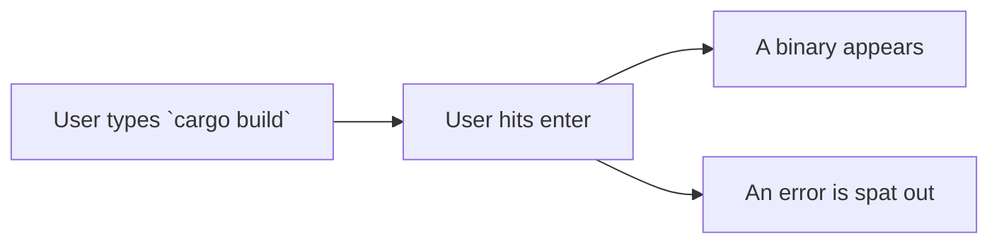
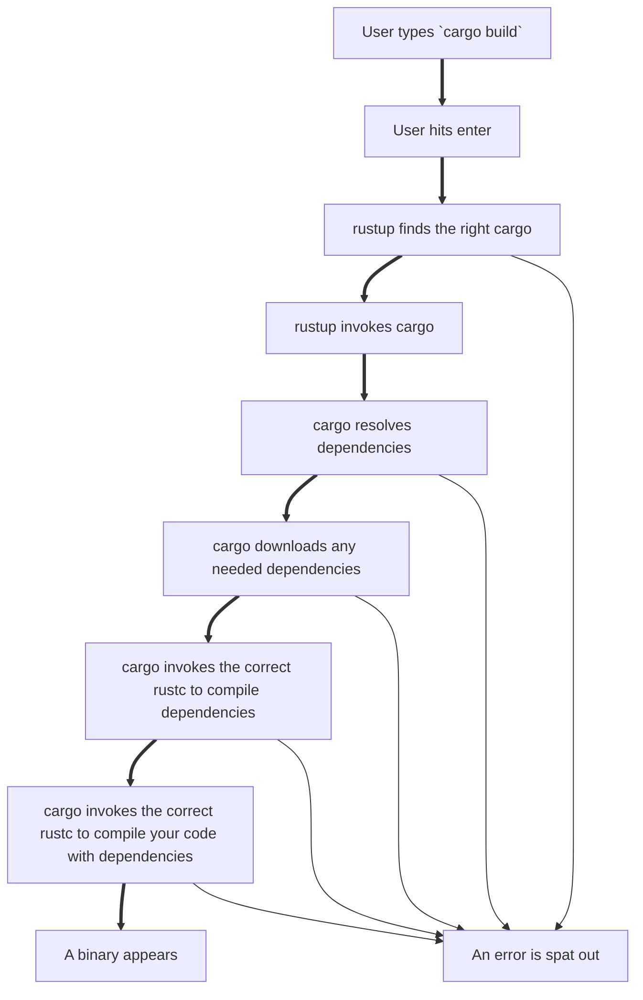
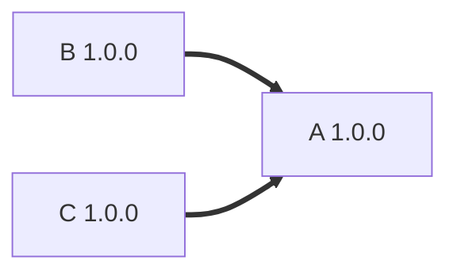
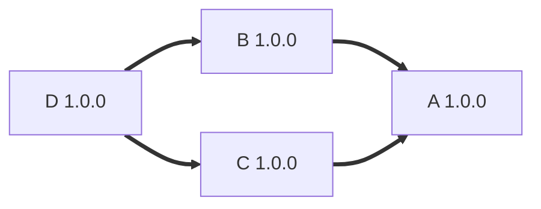
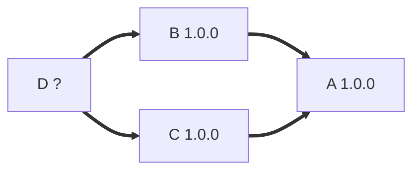
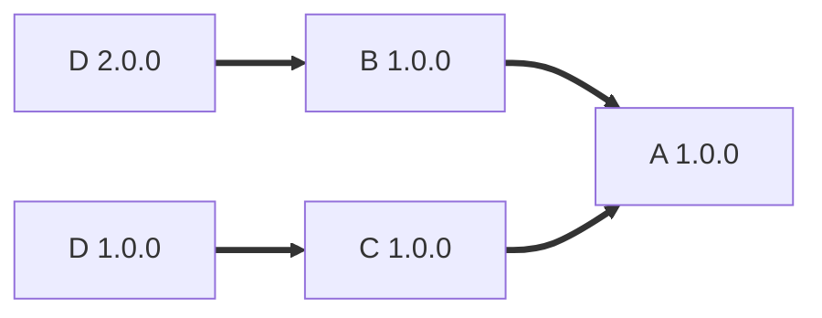

# What happens when you run `cargo build`?
Michael Gattozzi

---
layout: image-right
image: /images/portrait.jpg
transition: slide-left
---

# Who am I?

- Senior Software Engineer at InfluxData
- Currently working on InfluxDB 3.0 OSS/Pro
- Rust user since 1.0 released
- I think build systems are pretty neat

---
layout: intro
transition: slide-up
---

# What will you learn today?
- How `cargo` chooses the correct version of `rustc`
- How `cargo` compiles a basic, 0 dependency, program
- How `cargo` compiles a program with dependencies
- How dependencies and their versions are chosen

This is a high level dive into how `cargo` works. We only have 25 minutes so some details will be glossed over! There won't be any code today beyond some shell commands being shown.

---
layout: section
transition: slide-left
---

# A Basic Overview of `cargo`

---
layout: statement
transition: slide-left
---



---
layout: full
transition: slide-up
zoom: 2.1
---
<div class="absolute left-10% bottom-0%">


</div>

---
layout: section
transition: slide-left
---

# Which cargo?

---
transition: slide-left
---

# Finding `cargo`

When we call `cargo` we look it up on the system `PATH`

```bash
❯ which cargo
╭───┬─────────┬────────────────────────────────┬──────────╮
│ # │ command │              path              │   type   │
├───┼─────────┼────────────────────────────────┼──────────┤
│ 0 │ cargo   │ /home/michael/.cargo/bin/cargo │ external │
╰───┴─────────┴────────────────────────────────┴──────────╯
```

- On my machine we can see that `rustup` has installed it in `~/.cargo/bin`
- What's weird here is that with `rustup` we can have *multiple* versions of `cargo` installed so why is
there only one version of `cargo` here?
---
transition: slide-left
---
# Where are all the other `cargo`s?
With a bit of help from fd we can find it in our home directory

```bash
❯ fd -H -t x -g cargo
.rustup/toolchains/1.77.0-x86_64-unknown-linux-gnu/bin/cargo
.rustup/toolchains/1.72.1-x86_64-unknown-linux-gnu/bin/cargo
.rustup/toolchains/nightly-x86_64-unknown-linux-gnu/bin/cargo
.cargo/bin/cargo
.rustup/toolchains/1.75-x86_64-unknown-linux-gnu/bin/cargo
.rustup/toolchains/nightly-2024-02-05-x86_64-unknown-linux-gnu/bin/cargo
.rustup/toolchains/stable-x86_64-unknown-linux-gnu/bin/cargo
.rustup/toolchains/nightly-2024-03-22-x86_64-unknown-linux-gnu/bin/cargo
.rustup/toolchains/1.79.0-x86_64-unknown-linux-gnu/bin/cargo
.rustup/toolchains/1.75.0-x86_64-unknown-linux-gnu/bin/cargo
.rustup/toolchains/1.78.0-x86_64-unknown-linux-gnu/bin/cargo
.rustup/toolchains/1.80.0-x86_64-unknown-linux-gnu/bin/cargo
```

- We have the `cargo` that is on our path
- We also have the "missing" `cargo`s under `rustup`
- So which one is running?
---
layout: image
image: /images/always_has_been.jpg
transition: slide-left
---

---
layout: fact
transition: slide-left
---
# In fact it's not the only Rust program like this

---
transition: slide-left
---
```bash
ls -al ~/.cargo/bin | where num_links > 1 | select name num_links inode
╭────┬────────────────────────────────────────┬───────────┬──────────╮
│  # │                  name                  │ num_links │  inode   │
├────┼────────────────────────────────────────┼───────────┼──────────┤
│  0 │ /home/michael/.cargo/bin/rust-gdbgui   │        14 │ 12493348 │
│  1 │ /home/michael/.cargo/bin/cargo-clippy  │        14 │ 12493348 │
│  2 │ /home/michael/.cargo/bin/rust-lldb     │        14 │ 12493348 │
│  3 │ /home/michael/.cargo/bin/cargo         │        14 │ 12493348 │
│  4 │ /home/michael/.cargo/bin/cargo-miri    │        14 │ 12493348 │
│  5 │ /home/michael/.cargo/bin/rustup        │        14 │ 12493348 │
│  6 │ /home/michael/.cargo/bin/rust-analyzer │        14 │ 12493348 │
│  7 │ /home/michael/.cargo/bin/rustfmt       │        14 │ 12493348 │
│  8 │ /home/michael/.cargo/bin/rust-gdb      │        14 │ 12493348 │
│  9 │ /home/michael/.cargo/bin/rustdoc       │        14 │ 12493348 │
│ 10 │ /home/michael/.cargo/bin/rls           │        14 │ 12493348 │
│ 11 │ /home/michael/.cargo/bin/clippy-driver │        14 │ 12493348 │
│ 12 │ /home/michael/.cargo/bin/rustc         │        14 │ 12493348 │
│ 13 │ /home/michael/.cargo/bin/cargo-fmt     │        14 │ 12493348 │
╰────┴────────────────────────────────────────┴───────────┴──────────╯
```

- Note that the number of links for all of these is 14 and there are 14 programs here
- They also share the same inode which means they're all hardlinks to the same executable

---
layout: image
image: /images/spiderman.jpg
transition: slide-left
---

---
transition: slide-up
---
# So what's really going on when you hit enter?
- `cargo` is found on your `PATH`
- This "`cargo`" is run, but it is actually `rustup`
- `rustup` looks at arg0 to determine what program to run (e.g. if you run `cargo build` `cargo` is arg0 and `build` is arg1)
- It checks for a rust-toolchain.toml file to specify a version or it uses your default
- It downloads that version of `cargo` to `~/.rustup/toolchains` if it doesn't exist and runs that
  version of `cargo`

Using arg0 to know what program to run is a common trick that some tools use. `busybox` is a prime example of this as it puts multiple UNIX programs into one binary. It turns out these kinds of shennanigans can get extremely hairy, but are so nice for UX:

https://blog.axo.dev/2024/07/an-app-by-any-other-name

---
layout: section
transition: slide-left
---
# Building a binary/library with 0 deps

---
transition: slide-left
---

# Compiling a 0 dep library/binary

- `cargo` when invoked sets up logging and parses any flags passed to it
- It determines which subcommand to run (in our case `build`) and passes any needed context to that command
- A lock is acquired on the package cache to not cause conflicts
- Generate a plan to build the package (this is just one thing with no deps, proc macros, or build scripts)
- Execute the plan!
---
transition: slide-left
---

# Seeing that plan in action

```bash {all|6|8|9|11|14}
❯ cargo new --bin example-bin
    Creating binary (application) `example-bin` package
note: see more `Cargo.toml` keys and their definitions at https://doc.rust-lang.org/cargo/reference/manifest.html
❯ cd example-bin

❯ cargo build -v
   Compiling example-bin v0.1.0 (/home/michael/example-bin)
     Running `/home/michael/.rustup/toolchains/stable-x86_64-unknown-linux-gnu/bin/rustc
    --crate-name example_bin --edition=2021 src/main.rs --error-format=json
    --json=diagnostic-rendered-ansi,artifacts,future-incompat --diagnostic-width=50
    --crate-type bin --emit=dep-info,link -C embed-bitcode=no -C debuginfo=2
    --check-cfg 'cfg(docsrs)' --check-cfg 'cfg(feature, values())'
    -C metadata=abfac7f469ac353d -C extra-filename=-abfac7f469ac353d
    --out-dir /home/michael/example-bin/target/debug/deps
    -C incremental=/home/michael/example-bin/target/debug/incremental
    -L dependency=/home/michael/example-bin/target/debug/deps`
    Finished `dev` profile [unoptimized + debuginfo] target(s) in 0.24s

```

---
transition: slide-left
---
```bash{all|9}
❯ tree target/
target/
├── CACHEDIR.TAG
└── debug
    ├── build
    ├── deps
    │   ├── example_bin-abfac7f469ac353d
    │   └── example_bin-abfac7f469ac353d.d
    ├── example-bin
    ├── example-bin.d
    ├── examples
    └── incremental
        └── example_bin-33pb68b9ng0cz
            ├── s-gyxa8mj6nk-0g3ass3-75gfquiv0kxlh9a40mh2gdvts
            │   ├── 0zqewa04jk2xlw3afx087qse4.o
            │   ├── 4yg9sda5c0scga7xvzm7axw1f.o
            │   ├── 9hou1n98knxvg4qm81qdyyw4n.o
            │   ├── 9hqjigjesctkqbbkybt2te25q.o
            │   ├── aw3rcmjmd8c26hkt4iki3tkun.o
            │   ├── bm6y6opkzh0p6h6yetof346gi.o
            │   ├── dep-graph.bin
            │   ├── query-cache.bin
            │   └── work-products.bin
            └── s-gyxa8mj6nk-0g3ass3.lock

8 directories, 15 file
```
---
layout: section
transition: slide-left
---
# Building a binary/library with 1 or more deps

---
transition: slide-left
---

# Building a binary/library with 1 or more deps

- `cargo` when invoked sets up logging and parses any flags passed to it
- It determines which subcommand to run (in our case `build`) and passes any needed context to that command
- A lock is acquired on the package cache to not cause conflicts
- Generate a plan to build the package that will:
  - Resolve the dependency graph
  - Download any needed packages
  - Start from the roots to compile each package in the build graph as parallelized as possible
  - Compile the main binary/library linking the dependencies into it
- Execute the plan!

---
transition: slide-left
---
# Package Versioning: A Quick Primer


- B and C are our roots
- We can compile B and C in parallel
- When we are done compiling B and C we then link and compile them into A
---
transition: slide-left
---
# Package Versioning: A Quick Primer

- D is now our root
- We compile D
- We then compile B and C in parallel and link in D
- When we are done compiling B and C we then link and compile them into A
- Notably B and C use the same version of D
---
transition: slide-left
---
# Package Versioning: A Quick Primer
What happens though if C needs D at 1.0.0 but B needs D at 2.0.0?

- We have incompatible versions
- What options do we have available to us?
---
transition: slide-left
---
# Diamond Dependency Solutions
Either we don't compile unless we can get one and only one dependency version or we do the tradeoff cargo does and compile both versions

- Haskell's build system `cabal` expects users to have only one version!
- If B needed exactly 1.5.0 and C needed 1.5.x then we could resolve it to both use 1.5.0
- Semver is really hard and cargo makes a best effort to choose one version if it can
- Note the only exception to compiling two different versions for `cargo` is if that crate is used as a public dependency and it causes conflicts.
  - An example from work all of the crates we use need to use the same version of `object_store` because of the `ObjectStore` trait being used in public interfaces (`Arc<dyn ObjectStore>`)

---
transition: slide-left
---
# What's `cargo build` doing then?
- It looks at `Cargo.toml` for your crates deps or the `Cargo.lock` file if one exists
- It updates the registry (metadata about all packages on crates.io, their versions, and their dependencies)
- It recursively figures out the crates it needs via the registry
- It uses an algorithm to determine the versions of each of the crates it needs
  - https://docs.rs/cargo/latest/cargo/core/resolver/
- It either updates or creates a `Cargo.lock` file containing all of this information
- It downloads every crate it needs if it hasn't yet
- It compiles each dep starting at the roots and parallelizing it as much as possible
- It compiles the final binary/library

---
transition: slide-left
---
# Seeing it in action
Let's add a dep to our example crate
```bash
❯ cargo add clap --features derive
    Updating crates.io index
      Adding clap v4.5.15 to dependencies
             Features:
             # Ommitted for brevity
    Updating crates.io index
     Locking 29 packages to latest compatible versions
      Adding windows-sys v0.52.0 (latest: v0.59.0)
```

---
transition: slide-left
---
# Seeing it in action
Note that I already have many of these crates in my registry already downloaded so we only download syn
```bash
❯ cargo build
  Downloaded syn v2.0.74
  Downloaded 1 crate (268.0 KB) in 0.43s
   Compiling proc-macro2 v1.0.86
   Compiling unicode-ident v1.0.12
   Compiling utf8parse v0.2.2
   Compiling anstyle v1.0.8
   Compiling anstyle-query v1.1.1
   Compiling colorchoice v1.0.2
   Compiling is_terminal_polyfill v1.70.1
   Compiling heck v0.5.0
   Compiling clap_lex v0.7.2
   Compiling strsim v0.11.1
   Compiling anstyle-parse v0.2.5
   Compiling anstream v0.6.15
   Compiling clap_builder v4.5.15
   Compiling quote v1.0.36
   Compiling syn v2.0.74
   Compiling clap_derive v4.5.13
   Compiling clap v4.5.15
   Compiling example-bin v0.1.0 (/home/michael/example-bin)
    Finished `dev` profile [unoptimized + debuginfo] target(s) in 6.88s
```

---
transition: slide-left
---
# Seeing it in action
Let's look at it again with a verbose flag
```bash{all|4|5|7|8|9|10}
❯ cargo build -v
   # Ommitted for brevity
   Compiling clap v4.5.15
     Running `/home/michael/.rustup/toolchains/stable-x86_64-unknown-linux-gnu/bin/rustc --crate-name clap
    --edition=2021 /home/michael/.cargo/registry/src/index.crates.io-6f17d22bba15001f/clap-4.5.15/src/lib.rs
    --error-format=json --json=diagnostic-rendered-ansi,artifacts,future-incompat --diagnostic-width=89
    --crate-type lib --emit=dep-info,metadata,link -C embed-bitcode=no -C debuginfo=2 --warn=rust_2018_idioms '--warn=clippy::zero_sized_map_values' '--warn=clippy::verbose_file_reads' --warn=unused_qualifications --warn=unused_macro_rules --warn=unused_lifetimes --warn=unsafe_op_in_unsafe_fn --warn=unreachable_pub '--warn=clippy::trait_duplication_in_bounds' '--warn=clippy::todo' '--warn=clippy::string_lit_as_bytes' '--warn=clippy::string_add_assign' '--warn=clippy::semicolon_if_nothing_returned' '--warn=clippy::self_named_module_files' '--warn=clippy::same_functions_in_if_condition' '--warn=clippy::rest_pat_in_fully_bound_structs' '--warn=clippy::ref_option_ref' '--warn=clippy::redundant_feature_names' '--warn=clippy::rc_mutex' '--warn=clippy::ptr_as_ptr' '--warn=clippy::path_buf_push_overwrite' '--warn=clippy::negative_feature_names' '--warn=clippy::needless_for_each' '--warn=clippy::needless_continue' '--warn=clippy::mutex_integer' '--allow=clippy::multiple_bound_locations' '--warn=clippy::mem_forget' '--warn=clippy::macro_use_imports' '--warn=clippy::lossy_float_literal' '--warn=clippy::linkedlist' '--allow=clippy::let_and_return' '--warn=clippy::large_types_passed_by_value' '--warn=clippy::large_stack_arrays' '--warn=clippy::large_digit_groups' '--warn=clippy::invalid_upcast_comparisons' '--warn=clippy::infinite_loop' '--warn=clippy::inefficient_to_string' '--warn=clippy::inconsistent_struct_constructor' '--warn=clippy::imprecise_flops' '--warn=clippy::implicit_clone' '--allow=clippy::if_same_then_else' '--warn=clippy::from_iter_instead_of_collect' '--warn=clippy::fn_params_excessive_bools' '--warn=clippy::float_cmp_const' '--warn=clippy::flat_map_option' '--warn=clippy::filter_map_next' '--warn=clippy::fallible_impl_from' '--warn=clippy::explicit_into_iter_loop' '--warn=clippy::explicit_deref_methods' '--warn=clippy::expl_impl_clone_on_copy' '--warn=clippy::enum_glob_use' '--warn=clippy::empty_enum' '--warn=clippy::doc_markdown' '--warn=clippy::debug_assert_with_mut_call' '--warn=clippy::dbg_macro' '--warn=clippy::create_dir' '--allow=clippy::collapsible_else_if' '--warn=clippy::checked_conversions' '--allow=clippy::branches_sharing_code' '--allow=clippy::bool_assert_comparison' '--allow=clippy::blocks_in_conditions' '--allow=clippy::assigning_clones' --cfg 'feature="color"' --cfg 'feature="default"'
    --cfg 'feature="derive"' --cfg 'feature="error-context"' --cfg 'feature="help"' --cfg 'feature="std"' --cfg 'feature="suggestions"' --cfg 'feature="usage"' --check-cfg 'cfg(docsrs)' --check-cfg 'cfg(feature, values("cargo", "color", "debug", "default", "deprecated", "derive", "env", "error-context", "help", "std", "string", "suggestions", "unicode", "unstable-doc", "unstable-ext", "unstable-styles", "unstable-v5", "usage", "wrap_help"))' -C metadata=d5d3ad9e70a30fc6 -C extra-filename=-d5d3ad9e70a30fc6
    --out-dir /home/michael/example-bin/target/debug/deps
    -L dependency=/home/michael/example-bin/target/debug/deps
    --extern clap_builder=/home/michael/example-bin/target/debug/deps/libclap_builder-c9dfc52345e64d30.rmeta
    --extern clap_derive=/home/michael/example-bin/target/debug/deps/libclap_derive-b7256ea03934fc95.so --cap-lints allow`
```

---
transition: slide-left
---
# Seeing it in action
```bash{all|3|4|6|7|8|9}
# And finally invoking rustc on our final binary
   Compiling example-bin v0.1.0 (/home/michael/example-bin)
     Running `/home/michael/.rustup/toolchains/stable-x86_64-unknown-linux-gnu/bin/rustc
    --crate-name example_bin --edition=2021 src/main.rs
    --error-format=json --json=diagnostic-rendered-ansi,artifacts,future-incompat --diagnostic-width=89
    --crate-type bin --emit=dep-info,link -C embed-bitcode=no -C debuginfo=2 --check-cfg 'cfg(docsrs)' --check-cfg 'cfg(feature, values())' -C metadata=19de9c7373039783 -C extra-filename=-19de9c7373039783
    --out-dir /home/michael/example-bin/target/debug/deps -C incremental=/home/michael/example-bin/target/debug/incremental
    -L dependency=/home/michael/example-bin/target/debug/deps
    --extern clap=/home/michael/example-bin/target/debug/deps/libclap-d5d3ad9e70a30fc6.rlib
    Finished `dev` profile [unoptimized + debuginfo] target(s) in 6.76s
```

---
transition: slide-left
---
# Peeking into `target`

```bash{all|12|13|24}
❯ tree -I "*.d|*.rmeta|incremental|build" --prune target
target
├── CACHEDIR.TAG
└── debug
    ├── deps
    │   ├── example_bin-19de9c7373039783
    │   ├── libanstream-2add7994000672b1.rlib
    │   ├── libanstyle-2ffce3dd7e3a0f17.rlib
    │   ├── libanstyle_parse-534aae5427a00bf0.rlib
    │   ├── libanstyle_query-2670247d99f37bb1.rlib
    │   ├── libclap_builder-c9dfc52345e64d30.rlib
    │   ├── libclap-d5d3ad9e70a30fc6.rlib
    │   ├── libclap_derive-b7256ea03934fc95.so
    │   ├── libclap_lex-6ab278a595966695.rlib
    │   ├── libcolorchoice-a6abfa0520cb84fd.rlib
    │   ├── libheck-f10b3acfa716255c.rlib
    │   ├── libis_terminal_polyfill-254bc9c5bee28d57.rlib
    │   ├── libproc_macro2-4c24e61a51cb79c1.rlib
    │   ├── libquote-5a676f4bf2c81bf1.rlib
    │   ├── libstrsim-5c1fca5cd21bb3db.rlib
    │   ├── libsyn-23ad055c3313dc8d.rlib
    │   ├── libunicode_ident-542f5604bbfe0ac2.rlib
    │   └── libutf8parse-0fd400427d500834.rlib
    └── example-bin

3 directories, 20 files
```
---
transition: slide-left
---
# What did I leave out with `cargo build`?

- The registry and how it works
- Running and compiling tests
- Build scripts
- Proc macros
- Incremental builds
- and so much more

If you want to learn more it's worth browsing through the source code and making and compiling examples to see how it works and what files get output or made with the `-v` flag!

Code: https://github.com/rust-lang/cargo

Docs Rendered: https://docs.rs/cargo/latest/cargo/

---
layout: section
transition: slide-left
---
# Conclusion

---
layout: end
transition: slide-left
---
# Thanks for Listening!

Contact Information

Twitter: @mgattozzi

Mastodon: @mgattozzi@hachyderm.io

Email: michael@ductile.systems

---
transition: slide-up
---
# Quick Fun Facts

Here are few fun facts I learned while researching this talk:
- cargo uses the same job server as GNU make for interoperability and to allow `cargo` to be called in make scripts
  - https://docs.rs/jobserver/latest/jobserver/
- `src` is just a `cargo` convention, you can point `rustc` manually at a file and it will infer the module structure from there
- `rustc` is responsible for parsing out `#[test]` functions and building a test harness via the `--test` flag not `cargo`
- `cargo` has other conventions like `examples` and `tests` where it knows how to invoke `rustc` and then run those tests or examples for you that it generates
